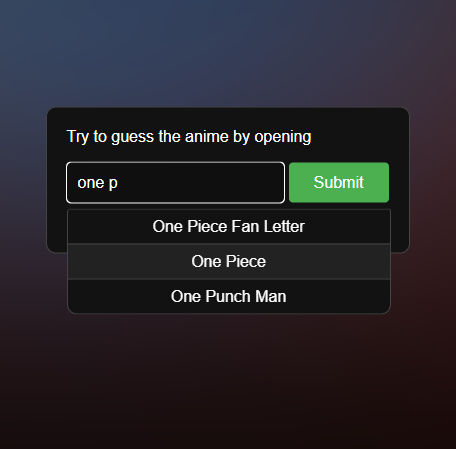

# [Guess Opening](https://justkesha.github.io/guess-opening/) by kesha

This is a simple web-application that tests your knowledge of anime openings.<br>
The goal is to figure out the anime name by one of it's openings as fast as possible.

Goto [justkesha.github.io/guess-opening](https://justkesha.github.io/guess-opening/)

### Overview

- **200+ openings** scraped using a python script from popular lists
- Using YouTube's IFrame API for audio & blurred background
- **Mobile support** thanks to responsive design

   

> [!NOTE]
> This idea was left on early in development and I currently don't plan on polishing it.<br>
> The core funcionality is there if you wanna try it out, you might wanna click on the background to start.<br>
> Some openings may not load as youtube blocks embeds for certain videos & I've not filtered those.

### Data

Openings list can be found in [this json](data/prod.json) file.<br>

*Note: that IDs under the `openings` field are YT video IDs.*

```json
  ...
  "R6t": {
    "name": "Shinseiki Evangelion",
    "episodes": 26,
    "popularity": 68,
    "year": 1995,
    "openings": [
      "fShlVhCfHig" // <- here is the opening video ID
    ]
  },
  ...
```

So the video link would be:<br>
https://www.youtube.com/watch?v=fShlVhCfHig

or just https://youtu.be/fShlVhCfHig
